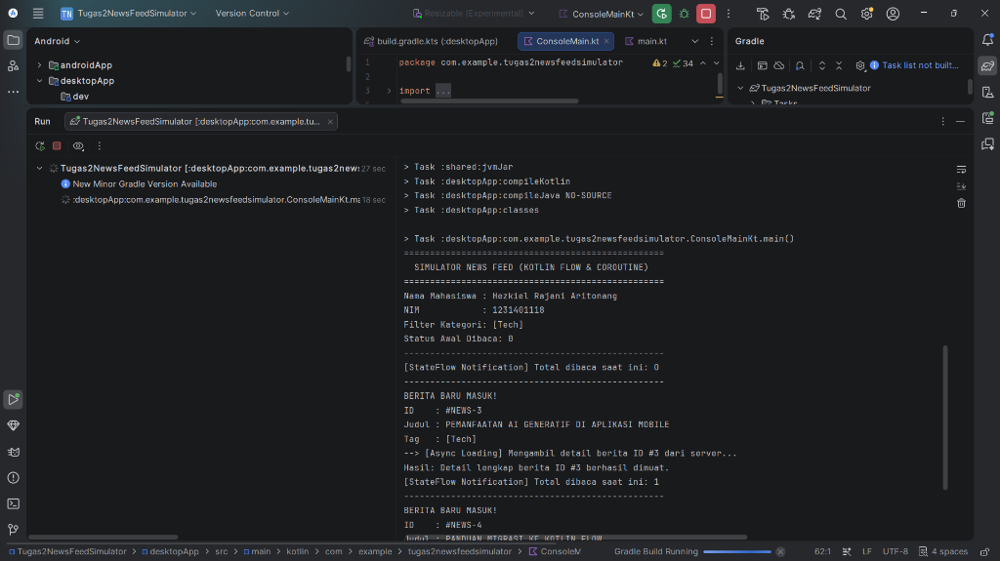

# News Feed Simulator

**Nama:** Hezkiel Rajani Aritonang  
**NIM:** 1231401118  

Proyek ini adalah implementasi tugas praktikum Pengembangan Aplikasi Mobile (Pertemuan 2) untuk materi **Advanced Kotlin, Coroutines, dan Flow**.
Dibangun di atas struktur Kotlin Multiplatform.

## 📌 Implementasi Tugas
1. **Flow Simulator (`getNewsStream`)**: Menggunakan *flow builder* dengan `delay(2000)` untuk mensimulasikan data masuk per 2 detik.
2. **Filter Operator**: Menggunakan `.filter { it.category == target }` untuk menyaring berita.
3. **Transform Operator**: Menggunakan `.map { }` untuk memformat berita menjadi `NewsDisplay`.
4. **StateFlow (`readCount`)**: Menyimpan state jumlah berita yang sukses dibaca.
5. **Coroutines Async (`launch`)**: Mengunduh detail berita secara paralel di dalam collector menggunakan suspend function `fetchNewsDetail`.
6. **🌟 BONUS (+10%)**: 
   - Dilengkapi Unit Test menggunakan `kotlinx-coroutines-test` di module `shared`.
   - Menggunakan operator `.catch` pada Flow dan `try-catch` konvensional untuk *error handling*.

## 🚀 Cara Menjalankan Aplikasi
1. Buka *repository* ini menggunakan **IntelliJ IDEA** atau **Android Studio**.
2. Tunggu Gradle selesai melakukan *sync*.
3. Buka file `desktopApp/src/main/kotlin/com/example/tugas2newsfeedsimulator/ConsoleMain.kt`.
4. Klik tombol **Run (Segitiga Hijau)** di sebelah kiri deklarasi `fun main()`.
5. Untuk menjalankan test, buka `shared/src/commonTest/kotlin/com/example/tugas2newsfeedsimulator/NewsFeedSimulatorTest.kt` dan jalankan test-nya.

## 📸 Hasil Test
Berikut adalah hasil dari program saat dijalankan:
